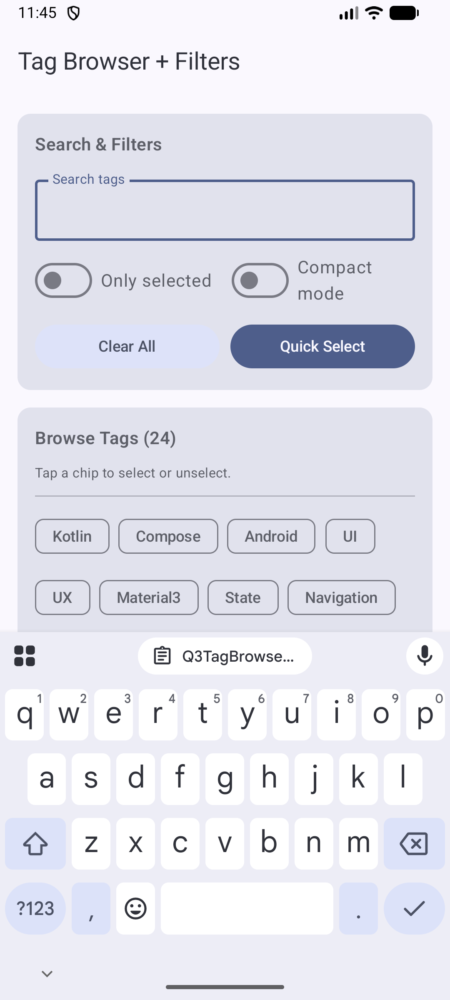

# CS501 IA3 - Q3 FlowRow / FlowColumn: Tag Browser + Filters

**Student:** Wenhao Wang  
**Assignment:** Individual Assignment 3 (Q3)  
**Question:** FlowRow / FlowColumn: Tag Browser + Filters

## Overview
This project implements a **Tag Browser** screen using Jetpack Compose and Material 3.

It demonstrates:
- `FlowRow` for wrapping chips across screen width
- `FlowColumn` for a secondary wrapped layout (filters or selected-tag display)
- dynamic selected state updates when chips are tapped

---

## Q3 Requirements Addressed

### Layout Requirements
- ✅ Uses **FlowRow** for dynamic tags/chips that wrap onto new lines
- ✅ Includes a second section using **FlowColumn** for a different purpose (filters or selected tags)
- ✅ Includes a **Selected Tags** area that updates based on user interaction (state)

### Material 3 Requirements
- ✅ Uses `FilterChip` / `AssistChip` (or similar chip component)
- ✅ Uses at least 4 more Material 3 components, such as:
  - `TopAppBar`
  - `Card`
  - `Text`
  - `Button` / `OutlinedButton`
  - `Divider`
  - `Surface`

### Modifier Requirements
This screen demonstrates:
- `Arrangement.spacedBy(...)` for consistent spacing
- `fillMaxWidth()` and `padding(...)` for responsive layout
- visual selected-state changes (color / elevation / border)
- chip wrapping behavior across different widths

---

## Interaction Behavior
- Tapping a chip toggles its selected state
- Selected tags are displayed in a dedicated "Selected Tags" area
- UI updates immediately using Compose state

---

## Screenshot

---

## How to Run
1. Open the project in **Android Studio**
2. Sync Gradle if prompted
3. Run on an emulator or Android device
4. Make sure `MainActivity.kt` displays the Q3 screen composable

---

## AI Disclosure
I used ChatGPT as a coding assistant for: debugging Compose imports/layout issues

---

## Repository Link
<!-- Replace with your actual Q3 repo link -->
https://github.com/JefferyWenhaoWang/cs501-ia3-q3
